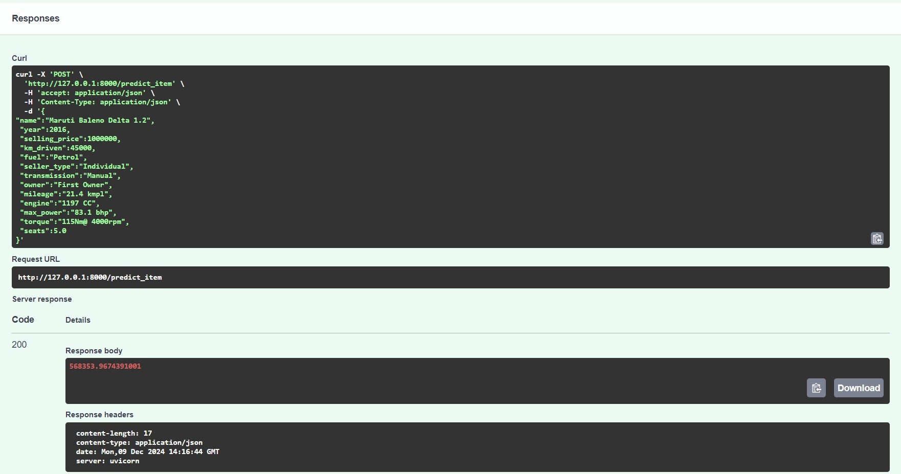
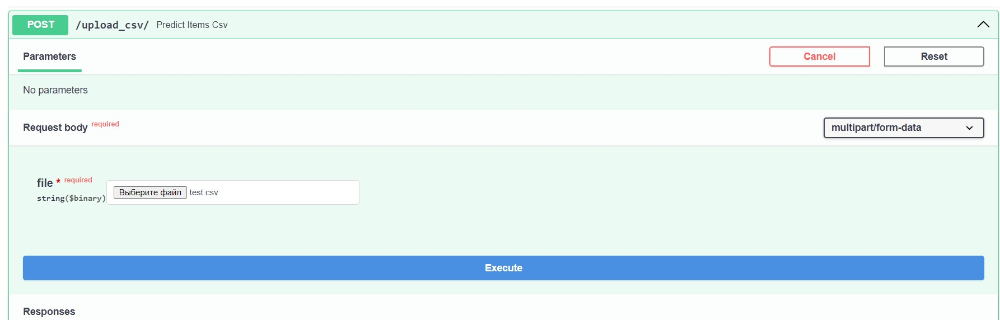
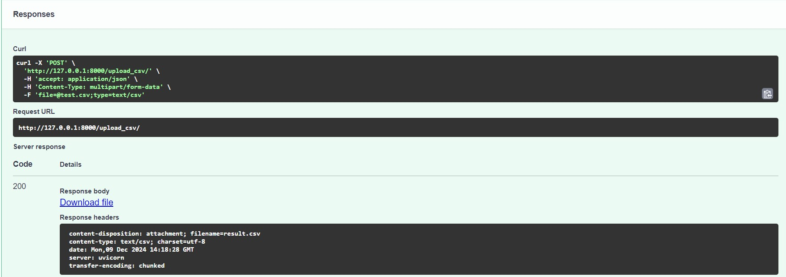
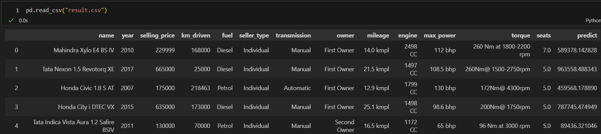

# ML_hw01
Homework №1 in ML from HSE

Что было сделано:
---
* предобработка датасета от дубликатов, пропусков, неверного формата колонок, неправильный формат значений
* проведен EDA
* построена визуализация взаимоствязей признаков между собой и с целевой переменной, расчитаны корреляции
* выявлены наиболее влияющие на таргет признаки
* построена базовая модель регрессии
* расчитаны метрики качества
* реализация кастомных функций подсчета корреляции и метрики качества, а ткаже L0 - регуляризация
* проведены эксперименты по улучшению качества модели, включающие подбор гиперпараметров с использованием GridSearchCV, генерацию новых признаков, кодирование категориальных признаков

Фотоотчетработоспособности программы
---
Прикрепляю результаты работы 2-ух ручек: с item и .csv, еще есть с list[item]

